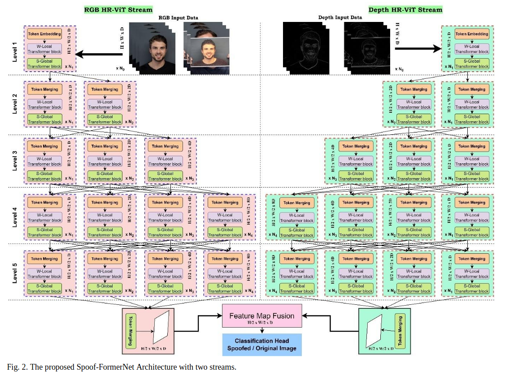
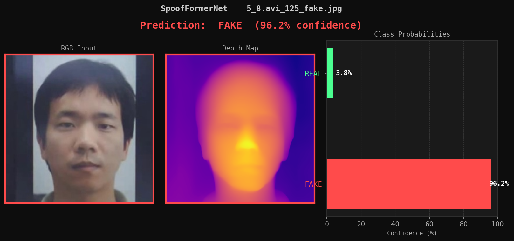
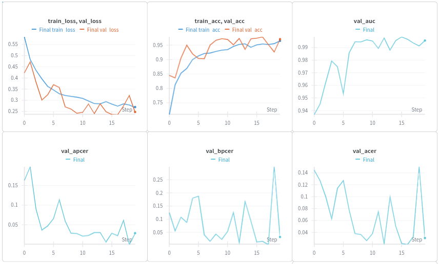

# SpoofFormerNet

**A PyTorch implementation of `Spoof-formerNet: The Face Anti Spoofing  Identifier with a Two Stage High Resolution  Vision Transformer (HR-ViT) Network`**

SpoofFormerNet fuses RGB color and monocular depth streams through a multi-branch HR-ViT architecture, combining local window attention and sparse global attention to distinguish live faces from presentation attacks.

---

## Table of Contents

- [SpoofFormerNet](#spoofformernet)
  - [Table of Contents](#table-of-contents)
  - [Overview](#overview)
  - [Architecture](#architecture)
  - [Project Structure](#project-structure)
  - [Setup](#setup)
  - [Data Preparation](#data-preparation)
    - [Download the data from https://www.kaggle.com/datasets/minhnh2107/casiafasd/data](#download-the-data-from-httpswwwkagglecomdatasetsminhnh2107casiafasddata)
    - [Pre-generate depth maps (required before training)](#pre-generate-depth-maps-required-before-training)
    - [Verify data loading](#verify-data-loading)
  - [Training](#training)
  - [Inference](#inference)
  - [Export](#export)
    - [TorchScript](#torchscript)
    - [ONNX](#onnx)
  - [Metrics](#metrics)
  - [Configuration](#configuration)
  - [Training Stats](#training-stats)
---

## Overview

Face anti-spoofing (FAS) is the task of detecting whether a presented face is a live person or a spoof attempt (printed photo, replay attack, 3D mask, etc.). SpoofFormerNet addresses this by:

1. **Dual-stream processing** — separate HR-ViT streams for RGB and estimated depth maps, then fusing them for classification.
2. **Multi-scale token embedding** — patch tokens at four scales (1×1, 3×3, 5×5, 7×7) to capture both fine-grained and coarse spatial features.
3. **Hybrid attention** — each transformer module pairs a *Window-Local* block (local texture cues) with a *Sparse-Global* block (long-range context), with learnable per-head priority weights.

---

## Architecture



**Model variants:**

| Variant | Params  | Levels | Branches | Use case        |
|---------|---------|--------|----------|-----------------|
| `tiny`  | ~0.81 M | 4      | 3        | Fast testing    |
| `base`  | ~5.83 M | 5      | 4        | Full training   |

---

## Project Structure

```
SpoofFormerNet_Pytorch/
├── README.md           # This README file
├── config.py           # Central hyperparameter config dict
├── dataloader.py       # SpoofDataset, PairedTransform, get_dataloaders
├── depth_estimator.py  # Depth-Anything-V2 wrappers (single image & directory)
├── embedding.py        # MultiScaleTokenEmbedding
├── export.py           # Export to TorchScript or ONNX with verification
├── infer.py            # Single-image inference (torch / torchscript / onnx)
├── loss.py             # SpoofingLoss (CrossEntropy + label smoothing)
├── metrics.py          # APCER, BPCER, ACER, EER, AUC
├── model.py            # SpoofFormerNet, HRViTStream, ConvStem, TokenMerge
├── test_model.py       # Component-level smoke tests
├── train.py            # Full training loop with W&B logging + early stoppin
├── transformer.py      # TransformerModule, WindowLocalBlock, SGlobalBlock, 
                        # WeightedMSA, LocalWindowAttentio, SparseGlobalAttention
├── utils.py            # Preprocessing, model loading/saving, helpers
├── visualize.py        # Batch preview and inference result visualization
├── wandb_utils.py      # Weights & Biases artifact/metric logging
└── data/
    ├── train_img/
    │   ├── color/               # Training RGB frames (.jpg)
    │   └── depth_generated/     # Pre-generated depth maps (same filenames)
    └── test_img/
        ├── color/               # Test RGB frames (.jpg)
        └── depth_generated/     # Pre-generated depth maps (same filenames)
```

---

## Setup

```bash
# Clone
git cloen https://github.com/abdelrahman-shaaban98/SpoofFormerNet_Pytorch.git
cd SpoofFormerNet_Pytorch

# Create virtual environment
python -m venv venv
. ./venv/bin/activate
# Install dependencies
pip install -r requirements.txt
```

---

## Data Preparation

### Download the data from https://www.kaggle.com/datasets/minhnh2107/casiafasd/data

### Pre-generate depth maps (required before training)

```python
from depth_estimator import estimate_depth_dir

estimate_depth_dir(
    input_dir  = "data/train_img/color",
    output_dir = "data/train_img/depth_generated",
)

estimate_depth_dir(
    input_dir  = "data/test_img/color",
    output_dir = "data/test_img/depth_generated",
)
```

Depth maps are generated with **Depth-Anything-V2-Small** and saved as `.jpg` files with the same filenames as the corresponding color images.

### Verify data loading

```bash
python dataloader.py
# Prints dataset stats, batch shapes, and saves a batch preview to images/
```

---

## Training

Edit `config.py` to adjust hyperparameters, then:

```bash
python train.py
```

Checkpoints are saved to `checkpoints/`:
- `best_model.pt` — best validation ACER
- `checkpoint_epoch_XXXX.pt` — periodic snapshots

---

## Inference

Inference automatically estimates depth for the input image at runtime (no pre-generated depth needed).

**PyTorch checkpoint:**
```bash
python infer.py \
  --image      data/test_img/color/1_1.avi_25_real.jpg \
  --infer-type torch \
  --model-path checkpoints/best_model.pt
```

**TorchScript:**
```bash
python infer.py \
  --image      data/test_img/color/5_8.avi_125_fake.jpg \
  --infer-type torchscript \
  --model-path checkpoints/spoof_former_net.torchscript.pt
```

**ONNX:**
```bash
python infer.py \
  --image      data/test_img/color/20_8.avi_175_fake.jpg \
  --infer-type onnx \
  --model-path checkpoints/spoof_former_net.onnx
```

All inference modes save a visualization to `images/inference_result_<type>.png` showing the RGB input, estimated depth map, and a confidence bar chart.



---

## Export

### TorchScript

```bash
python export.py \
  --checkpoint checkpoints/best_model.pt \
  --export-to  torchscript
# → checkpoints/spoof_former_net.torchscript.pt
```

### ONNX

```bash
python export.py \
  --checkpoint checkpoints/best_model.pt \
  --export-to  onnx
# → checkpoints/spoof_former_net.onnx
```

---

## Metrics

Evaluation is performed after every epoch on the test set. The following metrics are computed:

| Metric       | Description                                                  |
|--------------|--------------------------------------------------------------|
| **Accuracy** | Overall classification accuracy                              |
| **APCER**    | Attack Presentation Classification Error Rate — spoof samples misclassified as real |
| **BPCER**    | Bona fide Presentation Classification Error Rate — real samples misclassified as spoof |
| **ACER**     | Average Classification Error Rate — `(APCER + BPCER) / 2` (primary metric) |
| **EER**      | Equal Error Rate — threshold at which FAR ≈ FRR              |
| **AUC**      | Area Under the ROC Curve                                     |

The best checkpoint is selected by **lowest validation ACER**.

---

## Configuration

All training hyperparameters live in `config.py`:

```python
CFG = dict(
    # Data
    train_color_dir = "data/train_img/color",
    train_depth_dir = "data/train_img/depth_generated",
    test_color_dir  = "data/test_img/color",
    test_depth_dir  = "data/test_img/depth_generated",
    image_size      = 256,
    batch_size      = 4,
    num_workers     = 8,
    balance_classes = True,        # WeightedRandomSampler

    # Model
    model_variant   = "base",      # "tiny" | "base"
    num_classes     = 2,
    dropout         = 0.1,

    # Training
    epochs          = 20,
    lr              = 1e-4,
    weight_decay    = 1e-4,
    label_smoothing = 0.1,
    mixed_precision = True,        # AMP — set False for CPU

    # Checkpointing
    save_dir        = "checkpoints",
    save_every      = 5,

    # Early stopping
    patience        = 10,
    min_delta       = 1e-4,
)
```

---

## Training Stats
